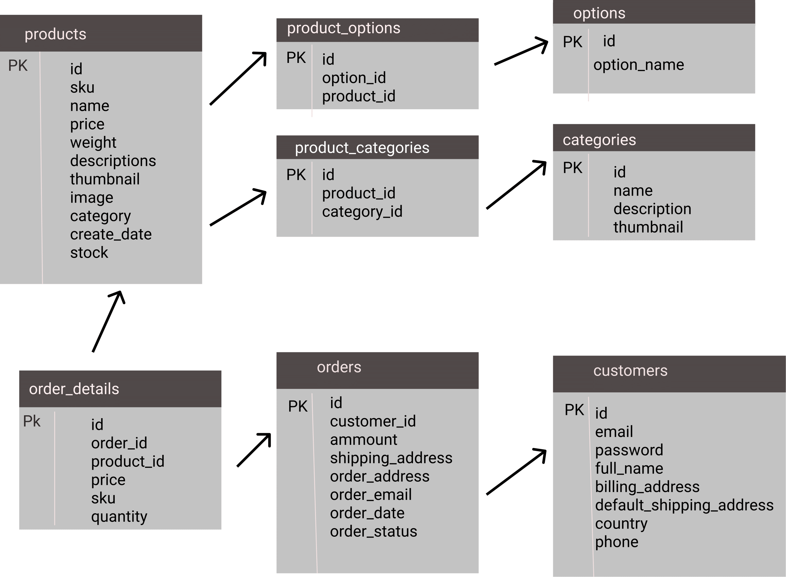
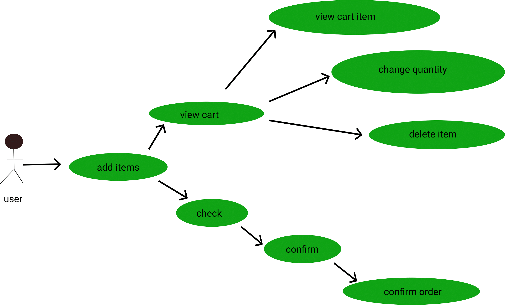
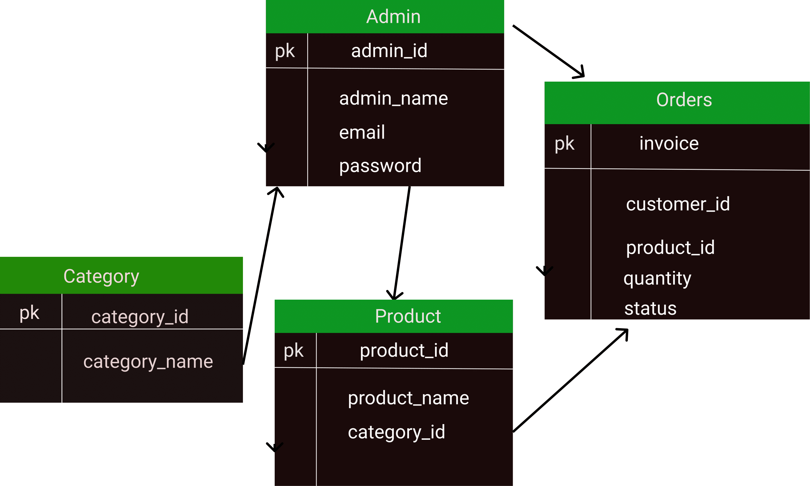
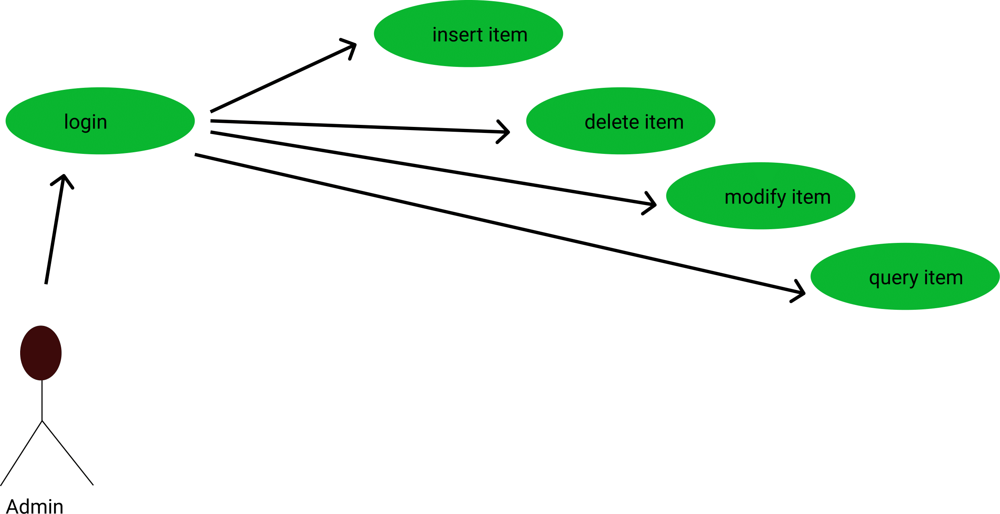

<h1 align="center"> FASHIONISTA </h1> 

-------- 

[View the live site here :]()

## OVERVIEW
Fashionista has been built as the 4th milestone project as part of Code Institute's Full Stack Software Development course.
Fashionista is a virtual 'E-commerce Website’It provides the user with a list of the various products available for purchase in the store. For the convenience of online shopping, a shopping cart is provided to the user. After the selection of the goods, it is sent for the order confirmation process. The system is implemented using Python’s web framework Django.

The scope of the project will be limited to some functions of the e-commerce website.
* customers can register for an account that way thye may log , make purchases and view their order history.
* The project provides security with the use of login ID and passwords, so that no unauthorized users can access your account. 
* It will display products,
* customers can select categories and select products, and can remove products from their cart specifying the quantity of each item. Selected items will be collected in a cart. At checkout, the item on the card will be presented as an order.
Customers can pay for the items in the cart to complete an order. - * stripe credit card payment is real but reamisn in test mode so no payments can be taken, * DO NOT USE YOUR REAL CREDIT CARD DETAILS*
- Please usee the following details to make a stripe payment.
  * Card: Number 4242 4242 4242 4242
  * Date: Any future date
  * CVC : Any 3 numbers
   

 # BASIC FOUNDAMENTAL PIECES
 The three basic parts of our database will be a: user, product, and order.
  ## Building the user
The user is the first foundational piece. The user interacts with the THE online store. In the online store you have products. As the user clicks through the products, they eventually decide to purchase a few of those products. When a user selects a product they add that to their order.
The basic foundational pieces of a user is a: name, password and email address. I create a user to save their information so they can keep track of their purchases and payment options.
In our database, we don’t directly save a product to a user. We do that through an order. The order is what keeps track of the products. Therefore, a user has many products through and order.

## Building the Product
The product is the second foundational piece. The online store has many products. Each product needs a few important pieces of information such as: name, description, price ,rating and category. As more products are added to the store, information is registered based on these characters.
As a user selects products to purchase, that information is saved through an order and not directly to the user. The reason being is that a product can belong to many users, not just one user. If there would be no order, there would be no way to allow other users to buy the product. Therefore, a product has many users through an order.
This will allow the products to be easily sorted through in the store for users.

## Building the Order
The order is the last foundational piece.  an order is the main transactional piece that allows users to interact with products through the store. The main foundational pieces of an order are: User ID foreign key, Product ID foreign key and the total amount of all the products.
As a user checks out of the store, this is what will allow the database to process the user and the products that, that user will be purchasing. By storing all the necessary information in an order, the database saves an instance of an interaction of a user with the stores products. The order item can have product details that allows the product to be customized by size and/or color.

# TABLE OF CONTENTS
## 1. [User Experience (UX)](#ux-design)
   * [Strategy](#strategy)
   * [Scope](#scope) 
   * [Structure](#structure)
   * [Strategy](#strategy)
   * [Skeleton](#skeleton)
   * [Surface](#surface)
## 2.[Information Architecture](#information-architecture)
   * [Database](#database)
   * [Data Model](#data-model)
## 3.[Technologies Used in the project](#technologies)
  * [Languages](#languages)
  * [Databases ](#databases)
  * [Libraries and frameworks](#libraries-and-frameworks)
  * [Other technologies](#other-technologies)  
## 4.[Testing](#testing)
  * [Code validation](#code-validation)
  * [Testing User stories](#testing-user-stories)
  * [Responsiveness and Compatibility](#responsiveness-and-compatibility)
  * [Testing performance](#testing-performance)
  * [Testing accessibility](#testing-accessibility)
  * [known bugs](#known-bugs)
## 5.[Deployment](#deployment)
  * [Deployment of the site](#deployment-of-the-site)
  * [How to run the code locally](#how-to-run-the-code-locally)
## 6.[Credits](#credits)
  * [Code](#code)
  * [Content](#content)
  * [Media](#media)
## 7.[Acknowledgment](#acknowledgments)
     
## [USER EXPERIENCE (UX)](#ux-design)
- ## [Strategy](#strategy)

  -  ## [Business Goals](#business-goals)
      * Attractive and accessible website that is responsive on all devices.
      * Products on the website can be easily modified(add,update,delete) by the admin.
      * Users can easily register an account
      * Payments via the website are fully secure.
      * The website is accessible also by non registered users.
      * Hold and secure information from all current and new customers so they may login to place orders.

   - ### [User Stories](#user-stories):
   
   - #### As a Shopper:
      1. As a shopper, i want to view a list of products so i can select some to purchase.
      2. As a shopper,  i would like view individual product details so i can identify the price and  product description.
      3. As a shopper , i would like to easily identify deals and offers so i can take advantage and save money shopping.
      4. As a shopper, i would like to the total of my purchases to avoid going over my budget.
      5. As a shopper, i would like to sort through a list of available products.
      6. As a shopper, i would like to sort through a specific category of product.
      7. A a shopper, i would like to search for a product using name or description.
      8. As a shopper, i would like to easily see the results of my search queries.
      9. As a shopper, i would like to easily select the size, quantity and color of product i wish to purchase.
      10. A a shopper,  i would like to be able to view items in my cart to be purchased so i can see the total cost and what i will be receiving.
      11. As a shopper, i would like to easily adjust the quantity of the items in my cart so i can easily make changes to my purchase before checkout.
      12. As a shopper , i would like to easily enter my payment information so i can checkout without hassles.
      13. As a shopper, i would like to  be able to fill in my payment information in a secure and safe way.
      14. As a shopper, i would like to view my order confirmation before checkout to verify that i havent made any mistakes.
      15. As a shopper, i would like to receive an email confirmation after checkout so that i can keep the confirmation of what I've purchased for my records.
      16.  As a shopper, i would like to  products that i like to my wishlist.
      17.  As a shopper, i would like read reviews drom other shoppers about cetrain products that i am interested in.
      18.  As a shopper, i would like to able to write reviews on a product i purchased.

      
   - ### As a site user:
     1. As a site user, i would like to easily register for an account so i can have a personalised account and can access my profile.
     2. As a site user, i would like to easily login and logout to access my personal account info.
     3. As a site user, i would like to easily recover my password incase i forget it so that i can recover access to my account.
     4. As a site user, i would like to receive an email confirmation after registering to be able to verify that registration was successfull.
     5. A site user, i would like to have a personalised user profile so that i can view my order history, order confirmation and save my payment information.
     
   - ### As a Store Owner:
     1. As a store owner , i would like to be able to add new products to the store.
     2. As a store Owner , i would like to be able to edit and update a product from the store.
     3. As a store owner , i would like to be able to delete a product from the store.
     
## [SCOPE](#scope)
The key features of the website is developed based on the user stories:
### For any site user:
 * Homepage with a revealing bg-image to easily help users understand the purpose of the site.
 * Products page where users can view all items based on their query searches as well.
 * Product Detail page with detailed information about the particular product, here users can choose size and quantity before adding item to cart.
 * Shopping cart page , where the user can view what product they added to their cart.
 * Checkout page, allowing users to purchase products.
 * Confirmation page , allowing users to see a confirmation message of their order
 * Contact page , where the users can contact the company with any questions .
 * Newsletter subscribe form that can allow users to sign up and get updates from the company.
 *  sign up page where users can register to be able to veiw purchase history and have a customer account
 * About us page , where users can find out more information about the company

## For registered users:
* Profile page, where users can update the default delivery information allowing ease of checkout.
* Order History, Users can see their previous order they made from the profile page
* wishlist page , where users can store their favourite items in the wishlist.
* product reviews, on the product detail page , where the users can leave a reating and message about a product they bought.
* Log out page, where users can securely log out of their page.

### For Store Owner:
  1. As a store owner , i would like to be able to add new products to the store.
  2. As a store Owner , i would like to be able to edit and update a product from the store.
  3. As a store owner , i would like to be able to delete a product from the store.
  4. as a store owner, i would like to be able to delete reviews from users who have left reviews

## [STRUCTURE](#structure)
## Existing Features
### Allauth features
The sign up, register, password reset, email confirmation pages etc, have all been provided by Django allauth and formatted to suit the needs of the site.
#### Admin Features
  * Admin will have access to additional features across the site. Firstly admin members will have an additional icon in the delivery banner (on larger devices) or link in the burger menu (on smaller devices) to take the user to the site admin page. Here the admin user will have access to:
  * Add a product page link - This will take the admin user to the add product page. Here the user can fill in the form to add a product to the site. Once added the admin user will be taken to the product detail page for the product added.
  * Manage Contact Messages - This will take the admin user to the contact management page. Here admin users will be displayed with all the queries that have been submitted by other users. Admin users can view details of these messages by clicking on the name in the table. On both the contact management page and the contact detail page admin users can delete the messages once they have responded to the user. This will trigger a modal to make sure the user is happy to delete the message.
  * On the product page and product detail page admin users will have access to the edit and delete product icons. The edit icon will take the user to the edit product form, where they can make changes to a product (i.e put in the women's category). The delete icon will trigger a modal to make sure the user wishes to delete the product and avoid accidental deletions.
### Base Template
* Delivery Banner - The delivery banner contains information about free delivery and the free delivery threshold. It is fixed to the top of the screen to allow for ease of access and improved user navigation. The links take users to different parts of the site which are as follows:
 * Unregistered user:
   * Login link
   * Register link
 * Registered user:
   * Wishlist
   * Profile
   * Log Out
### Navbar
### Footer
The footer has all the important shop links .
### Homepage
The home page hs a background the navigation links, logo, hero image, call to action button,deals categorised men,women children section and the footer.
### Product page
### product detail page
### Toasts Messages
  * Toast message boxes have been used through out the site to display the feedback to the user when they have made interactions with the site. These messages are color coded to transmit different kinds of information:
    * Green: Success
    * Red : Errors
    * Blue : Informative
    * Yellow : Warning
### shopping cart  page
  The shopping cartg page can be broken into 5 parts for each product added to their cart:
  * Product - which displays an image of the product the user has added to their bag.
  * Product info - displays the name of the product, product sku and the product size (if applicable).
  * Price - displays the individual product price.
  * Quantity - Users are able to update their order using the quantity selectors and the update button. Users can also remove that product from their shopping cart entirely by clicking the remove button.
  * Subtotal - displays the subtotal for each product (product price * quantity).
Underneath the products that are in the user's cart, there is information for cart total, delivery and grand total. If a user does not meet the free delivery threshold a helpful message will be displayed to let them know what they need to spend in order to qualify for free delivery.
  * There is a button to take the users back to the all product page, and a "Secure Checkout" button to take the user to the checkout page.
  * If the user has no items in the shopping cart, a message is displayed to the user to let them know this and a button to take the user to the all products page is displayed.
### Checkout page
The Checkout page is split into two columns on larger devices, and 2 rows on smaller devices:
 * Order Summary - Gives a nice overview of each of the products that they are purchasing. Images are links that will take the user back to the product details page for that product. Users can also see a breakdown of the order total, delivery and grand total.
 * Checkout Form - split into 3 sections:
   * Details - where users are invited to fill out their full name and email address. Email address will be auto populated if a user has logged in and saved this information to their profile.
   * Delivery - Users can fill in where they wish their products to be delivered to. These fields will be auto populated if a user has logged in and saved this information to their profile.
   * Payment - Users can enter their card details here in order to make payments and purchase their chosen products.
 * Below the checkout form, users can click the "Adjust cart" button to make adjustments to their shopping cart, or click the "Complete Order" button to make their purchases. Users are informed exactly how much they will be charged with a helpful message directly underneath the "Complete Order" button.
 ### Checkout success page
 * When a user successfully checks out a success toast will be shown to the user with the order number and a confirmation email will be sent to the user with some of the details of their order.
 * The checkout success page itself is split into two sections:
   * Order information which details the order info, delivery details and billing info.
   * Order Summary - Gives a nice overview of each of the products that they are purchasing. Images are links that will take the user back to the product details page for that product.
 * More products link which will take the user back to the all products page encouraging the user to make more purchases.
 ### About us page
  * Users can find out more about the company by clicking the about us link under the company dropdown (on larger devices), or within the burger menu.
  * Users are greeted with a hero image with the company mantra about the products.

 ### Contact us page
  * Users can find different ways to contact the company on the contact page. Details for the company address, telephone, email and opening times can be found here.
  * The next section on this page allows users to contact the company using the form provided. Once the user submits a valid form a success message is displayed to the user to provide feedback and an email confirmation is sent to the user to let them know that we have received their query.
   * Contact messages can be located on the site administration page (for superusers only).
 ### Profile page
   * Here users can update their default information by filling in the form and clicking update info button allowing them to ease purchases at checkout.
   * Regarding information aboutuser's past orders, users can click the order number to take them to the checkout success page .
 ### Wishlist page
  * This page will only be available to logged in users. if the user has not added any products to their wishlist then the user will be informed about this and a link to all_products page is displayed.
  * When the used has added products to their wishlist ; they will be displayed here in the same format as the products page.
### Features left to implement
  * image variations for a particular item

* Superuser:
   * Site Administration
   * Wishlist
   * Profile
   * Log Out

## [Skeleton](#skeleton)
Below you may find the links for my wireframs , showing how i wish the pages to be structured and how th esite will appear on different screen sizes.
The wireframes have been created using balsamique and show for desktop , ipad and iphone.

 ### Customer Interface:
     1. Customer shops for a product
     2. Customer changes quantity
     3. The customer adds an item to the cart
     4. Customer views cart
     5. Customer checks out
     6. Customer sends order

  Database schema
  

  * Use-Case diagram for customer
  

  ### Admin Interface:
    1. Admin logs in
    2. Admin inserts item
    3. Admin removes item
    4. Admin modifies item

  * ER diagram for admin
  

  * Use-Case diagram for Admin
  

     
   ## Wireframes
    Wireframes/Database Tables Link - [Wireframes](Documentation/Wireframes/Wireframes.pdf)
   *Design Changes to Wireframes**
   

## [Surface](#surface)
 design- colour choice
# [Technologies Used In The Project](#technologies)

* Django
  * Django is a high-level Python Web framework that encourages rapid development and clean, pragmatic design. https://www.djangoproject.com/

* SQlite3 
   * SQLite is a C-language library that implements a small, fast, self-contained, high-reliability, full-featured, SQL database engine. SQLite is the most used database engine in the world. https://www.sqlite.org/index.html

* PostgreSQL
  * PostgreSQL is a powerful, open source object-relational database system. https://www.postgresql.org/

* Gitpod
  * Gitpod is a cloud-based integrated development environment (IDE) that has been used to write, run, and debug the code used for the web-app. https://www.gitpod.io/
 
* Github
  * GitHub has been used for version control of the code by using Git functions in the control panel. Github was utilised frequently during the development of the web-app. https://github.com/

* Heroku
   * This is a cloud based application platform that allows deployment of an application to the web and connection to the database. https://heroku.com/
  
* AWS S3 
  * Amazon Simple Storage Service (Amazon S3) is an object storage service that offers industry-leading scalability, data availability, security, and performance. https://aws.amazon.com/s3/

* Figma 
   * Figma was used to create use-case diagrams

pdf2png site was used to convert pdf files to png [pdf2png](https://pdf2png.com/)

 * Balsamique
   * Balsamiq was used to create the wireframes https://balsamiq.com/
  
### Front-End Technologies

* HTML 5 
  * The web-app uses HTML5 as a fundamental basis for building the web-app. Where possible semantic HTML is used to give the user a 
better understanding.

* CSS3 
  * The web-app uses CSS3 for styling of elements within the website. It is linked from the page to the *style.css* file.

* Bootstrap4 
  * The open-source Bootstrap framework has been used to implement the layout of the site. Bootstrap is also utilised 
to accommodate the responsive and mobile first design of the dashboard. https://getbootstrap.com/

* Django-forms-bootstrap   
  * A simple bootstrap filter for Django forms. Extracted from the bootstrap theme.
https://django-bootstrap3.readthedocs.io/en/latest/

* JavaScript 
  * The web-app uses Javascript to provide dynamic interactivity, as it is a full-fledged versatile programming language.
https://www.javascript.com/

* JQuery 
   * The web-app uses jQuery, as it simplifies a lot of complicated tasks from JavaScript, such as AJAX calls and DOM manipulation. 
https://www.jquery.com/jquery-3.4.1

* Google Fonts 
  * The dashboard uses Google fonts to accentuate certain text. https://fonts.google.com/

### Back-End Technologies

* Python 
  * Python emphasises readability, uses English keywords and is highly extensible. The core language itself is quite small, 
and it is easy to learn for brginners. https://www.python.org/  

* Gunicorn
   * Gunicorn ‘Green Unicorn’ is a Python WSGI HTTP Server for UNIX. The Gunicorn server is broadly compatible with 
various web frameworks, simply implemented, light on server resources, and fairly speedy. https://docs.gunicorn.org/en/stable/

* Pillow
   * The Python Imaging Library adds image processing capabilities to your Python interpreter. This library provides
extensive file format support, an efficient internal representation, and fairly powerful image processing capabilities. 
https://pillow.readthedocs.io/en/stable/handbook/overview.html

* Psycopg
   * Psycopg is the most popular PostgreSQL database adapter for the Python programming language. Its main features are 
the complete implementation of the Python DB API 2.0 specification and the thread safety. https://pypi.org/project/psycopg2/ 

* boto3
   * Boto is the Amazon Web Services (AWS) SDK for Python. It enables Python developers to create, configure, and manage AWS 
services, such as EC2 and S3. https://boto3.amazonaws.com/v1/documentation/api/latest/index.html

* Jinja 
   * This is a modern and designer-friendly templating language for Python. It is fast, widely used and secure with the optional 
sandboxed template execution environment. https://jinja.palletsprojects.com/en/2.11.x/

* Stripe 
  * Checkout creates a secure, Stripe-hosted payment page that lets you collect payments quickly. It works across devices 
and is designed to increase conversion. Checkout makes it easy to build a first-class payments experience. 
https://stripe.com/docs/payments/checkout

## Testing

### Code validation
* W3C Markup Validation Service for HTML.
* W3C CSS Validation Service was used for validating the code.
* jslint
* http://pep8online.com/ - For Validation Python Code.
* Slack - Peer Code Review Forum.

### Testing User Stories
* Admin(superuser) can log in, add categories, add products, delete categories, delete products, modify products,delete orders .
* Non registered users can use the site but at checkout need to fillout their email and adress deatails.
* users can log in and out of the site
* users can register  for an acount
* both unregistered and registered users can browse through all products
* clicking on any individual categories takes us to the specific categories
* users can browse through deals in different categories, women, men and kids.
* users can sort items by price, rating,category and name
* users can choose specific product sizes and quantity.
* users may update the product either by chnging sizes or adding the quantiy or even deleting the product from their cart.
* dropdown box updates when a criteria is chosen from the navbar
* search funtionality works and returns the query result searched for
* users can proceed with payment and recieve a confirmation message.
* after purchase users can click the link for latest deals to take them to the latest deals page or to the user's profile page.
* an error is thrown when the wrong postcode ,card digits and card expiry date are entered i the checkout  payment form.
* success toast confirmation message pops up after an order is passed,with a specific order number and informing buyer of which email the order details shall be sent to.
* profile details are saved, making it easier for a registered user to complete their purchase without prefilling the adress details.
* when a non test card is used for stripe payment, wronf postal code and not a future date is used, an error message is receieved  clearly informing you of the error and how to fix it.
### Responsive and Campartibility Testing

### Testing Performance

### Testing Accessibility

## known bugs
* btt-link hidden not showing once on the bottom of the page - solved with a z-index on btt-button and border color change.
* footer doesnt stick to bottom on empty pages. solved with class of stickiy 
* email confirmation bug - i checked the endpoint urls both in stripe and gitpod , modified sign in stripe secret as stripe_wh_secret in gitpod workspace variable.refresh the page,restarted workspace.checked the webhook handler.py file,  fixed
* 401 stripe webhook error - changed port 8000 to public

## Deployment

### Live Website Link

### Repository Link

### Running Code Locally

To deploy the project the following is required:-

- Github account
- Heroku Account
- AWS Account

To create a clone follow the below steps:- 

Github
1. Login to github and find the repository.
2. Click Code and open with Github Desktop.
3. Follow the prompts in the GitHub Desktop Application.

Heroku Deployment with AWS

1. Install gunicorn, psycopg2-binary and dj-database-url using the PIP Install command.
2. Freeze all the requirements for the project into a requirements.txt file using the pip3 freeze > requirements.txt command.
3. Create a procfile, with the following inside it: web: gunicorn pjc_plant_services_ms4.wsgi:application
4. Push these changes to GitHub, using git add . git commit -m and git push commands.
5. Navigate to [Heroku](https://www.heroku.com/), and login or create an account.
6. Once logged in, click on 'resources'.
7. From the add-ons search bar, add the Heroku Postgres DB, select the free account, and then submit order form to add it to the project.
8. From the app's dashboard, click on 'settings', and then 'reveal config vars' in order to set the necessary configuration variables for the project. 
It should look like this: 

| Key                   | Value                      |
|-----------------------|----------------------------|
| AWS_ACCESS_KEY_ID     | Your AWS Access Key        |
| AWS_SECRET_ACCESS_KEY | Your AWS Secret Access Key |
| DATABASE_URL          | Your Database URL          |
| EMAIL_HOST_PASS       | Your Email Password        |
| EMAIL_HOST_USER       | Your Email Address         |
| SECRET_KEY            | Your Secret Key            |
| STRIPE_PUBLIC_KEY     | Your Stripe Public Key     |
| STRIPE_SECRET_KEY     | Your Stripe Secret Key     |
| STRIPE_WH_SECRET      | Your Stripe WH Key         |
| USE_AWS               | TRUE                       |

9. Back on the main dashboard, click on 'deploy', and then under the 'Deployment' method section, select GitHub and 'Automatic Deploys'.

10. Ensure that in settings.py, the following code is commented out:

Database
 https://docs.djangoproject.com/en/3.1/ref/settings/#databases

and the following code is added:

DATABASES = {
        'default': dj_database_url.parse(os.environ.get('DATABASE_URL'))
    }
11. Make migrations using the following command:
python3 manage.py makemigrations
and migrate the database models to the Postgres database using the following command:
python3 manage.py migrate

12. New products can be entered via the Django Admin panel or the SQLLite Database can be imported by using the following command
python3 manage.py loaddata

13. Create a new superuser with the following command:
python3 manage.py createsuperuser
and then enter chosen email, username and password.

14. In settings.py, contain the previously entered database setting in an if statement, and add an else condition, so that different databases are 
used depending on the environment.

if 'DATABASE_URL' in os.environ:
    DATABASES = {
        'default': dj_database_url.parse(os.environ.get('DATABASE_URL'))
    }
else:
    DATABASES = {
        'default': {
            'ENGINE': 'django.db.backends.sqlite3',
            'NAME': BASE_DIR / 'db.sqlite3',
        }
    }

15. Disable 'COLLECTSTATIC' with the fillowing code: heroku config:set DISABLE_COLLECTSTATIC=1
so that Heroku doesn't attempt to collect the static files.
16. Add ALLOWED_HOSTS = ['pjc-plant-services-ms4.herokuapp.com', 'localhost', '127.0.0.1'] to settings.py.
17. Add Stripe environment variables to settings.py.
18. Push to Heroku using the following command:
    git push heroku master

Amazon Web Services:

All Static and media files for the deployed version of the site are hosted in a Amazon Web Services(AWS) S3 bucket. 
In order to create your own bucket, please follow the instructions on the AWS website 
[Here](https://docs.aws.amazon.com/AmazonS3/latest/userguide/creating-bucket.html)

1. In the gitpod terminal, install boto3 and django-storages using the following commands:
   pip3 install boto3 and pip3 install django-storages
2. Freeze the new requirements into the 'requirements.txt' file using the pip3 freeze > requirements.txt command
3. Add 'storages' to INSTALLED_APPS in settings.py.
4. Add the following code to settings.py in order to link the AWS bucket to the website:

if 'USE_AWS' in os.environ:
    # Cache control
    AWS_S3_OBJECT_PARAMETERS = {
        'Expires': 'Thu, 31 Dec 2099 20:00:00 GMT',
        'CacheControl': 'max-age=94608000',
    }

    # Bucket Config
    AWS_STORAGE_BUCKET_NAME = 'ms4-pjc-plant-services'
    AWS_S3_REGION_NAME = 'eu-west-2'
    AWS_ACCESS_KEY_ID = os.environ.get('AWS_ACCESS_KEY_ID')
    AWS_SECRET_ACCESS_KEY = os.environ.get('AWS_SECRET_ACCESS_KEY')
    AWS_S3_CUSTOM_DOMAIN = f'{AWS_STORAGE_BUCKET_NAME}.s3.amazonaws.com'

    # Static and media files
    STATICFILES_STORAGE = 'custom_storages.StaticStorage'
    STATICFILES_LOCATION = 'static'
    DEFAULT_FILE_STORAGE = 'custom_storages.MediaStorage'
    MEDIAFILES_LOCATION = 'media'

    # Override static and media URLs in production
    STATIC_URL = f'https://{AWS_S3_CUSTOM_DOMAIN}/{STATICFILES_LOCATION}/'
    MEDIA_URL = f'https://{AWS_S3_CUSTOM_DOMAIN}/{MEDIAFILES_LOCATION}/'

5. Create a custom_storages.py file in the root level of the project. Inside it, include the locations of the Static Storage and Media Storage.
6. Delete DISABLE_COLLECTSTATIC from the Heroku Config Variables.
7. Finally, push to GitHub, and all changes should be automatically pushed to Heroku too.

Making a Local Clone:
In order to make a local clone of the PJC Plant Services website, enter git clone https://github.com/Atinos31/Fashionista2 into the terminal. 

Next, create an .env.py file in the root directory of the project, and add it to the .gitignore file. 
The following code needs to be added to the .env.py file:

import os  
os.environ["DEVELOPMENT"] = "True"    
os.environ["SECRET_KEY"] = "<Your Secret Key>"
os.environ["STRIPE_PUBLIC_KEY"] = "<Your Stripe Public Key>"    
os.environ["STRIPE_SECRET_KEY"] = "<Your Stripe Secret Key>"    
os.environ["STRIPE_WH_SECRET"] = "<Your Stripe WH Secret Key>"   

Then make sure that the required packages are installed by running the following command: 
pip install -r requirements.txt

Make migrations and then migrate in order to create a database, by running the following commands:
python3 manage.py makemigrations and python3 manage.py migrate.

New products can be entered via the Django Admin panel or the SQLLite Database can be imported by using the following command
python3 manage.py loaddata

Create a superuser with the following command: python3 manage.py createsuperuser and entering your email, username and password.

Run the app by entering the following command:
python3 manage.py runserver

---

## Credits

### Code

I used the following links to help my coding:-
- Code Institue task project for setup and linking to AWS.
- https://stackoverflow.com/ - for various issues when writing queries in Python.
- https://www.w3schools.com/python/default.asp - for extra help and tuition with Python.
- https://miniwebtool.com/django-secret-key-generator/ - for generating the secret key
- https://getbootstrap.com/docs/5.0/getting-started/introduction/ - For help with bootstrap classes
- http://ami.responsivedesign.is/ - For help with how the site looked on different devices
- https://dashboard.stripe.com/test/dashboard - For stripe JS Code for my project and webhooks testing

### Content
   This README.md file is based on the Code Institute template.

### Media
 images used are from the same boutique ado project although they have been full catergorised.

### Acknowledgements

Many Thanks to the below for the help and guidances throughout my project:- 
- My Mentor 
- Code Institues support team for increasing my hand in date and being supportive.
- The peercode channel on slack for feedback on my website. 
- Code Institute and the Boutique-Ado Project
 

   
    
